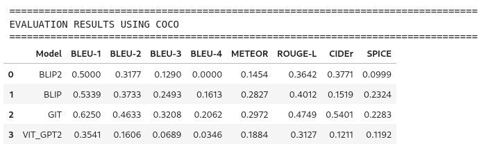

# Image Captioning 


## Installation
```bash
git clone https://github.com/aduy2408/Image-Captioning
cd Image-Captioning
pip install -r requirements.txt
```
## Quick run
```bash
streamlit run app.py
```

## Project Architecture

```
Image-Captioning/
├── app.py                          #  Streamlit web interface
├── model/
│   └── image_captioning_models.py     # model implementations 
├── notebooks_experiment/
│   ├── Image_captioning.ipynb         # Model experimentation & development
│   └── eval.ipynb                     # Comprehensive evaluation pipeline
├── test_images/
│   └── images/                        # Test images (10 images from COCO)
├── eval_result_json/               # Model evaluation results(Contain captions generated and groundtruth)
│   ├── local_evaluation_blip.json
│   ├── local_evaluation_blip2.json
│   ├── local_evaluation_git.json
│   └── local_evaluation_vit_gpt2.json
├── captions_ground_truth.json      # COCO ground truth annotations
└── requirements.txt               
```

## Models

### 1. **BLIP-2** (Salesforce/blip2-opt-2.7b)

### 2. **BLIP** (Salesforce/blip-image-captioning)

### 3. **GIT** (microsoft/git-base-coco)

### 4. **ViT-GPT2** (nlpconnect/vit-gpt2-image-captioning)

## Core Components

### Model Engine (`model/image_captioning_models.py`)

### Web Interface (`app.py`)


### Evaluation (`notebooks_experiment/`)

**Metrics:**
- **BLEU Scores**: BLEU-1, BLEU-2, BLEU-3, BLEU-4 
- **CIDEr Score**: 


## Performance Benchmarks

### Evaluation Results (COCO Test Set - 10 Images)




## Configuration

### Optimization Settings
```python
# In model/image_captioning_models.py
GENERATION_CONFIG = {
    "max_length": 200,        # Maximum caption length
    "min_length": 25,         # Minimum caption length  
    "num_beams": 8,           # Beam search width
    "length_penalty": 1.2,    # Length normalization
    "repetition_penalty": 1.3, # Repetition avoidance
    "temperature": 0.8,       # Sampling temperature
    "top_p": 0.9,            # Nucleus sampling
    "do_sample": True         # Enable sampling
}
```

## Usage:
- Use the pre-downloaded images in /test_images for data and uses it with the Image_captioning.ipynb file to run test.
- Run app.py with streamlit to use with UI
- Run eval.ipynb to evaluate the models (change directory to your path for eval_result_json)
- Optional: Run Image_captioning.ipynb to test the models and the components

## Production Suggestions:

### Speed optimization

**Model loading +caching**
- Implement Redis or Memcached for persistent model caching across sessions
- Pre-load frequently used models during application startup
- Implement lazy loading for less frequently used models to reduce resource usage

**Inference acceleration**
- Apply quantization (INT8/FP16) to reduce model size and increase inference time but could sacrifice some performance, which can be tested to find an optimal point.
- Implement batch processing to handle multiple images simultaneously instead of sequentially
- Use CUDA streams for overlapping data transfer and computation operations

**Network and I/O optimization**
- Implement asynchronous request handling(ex: FastAPI)
- Use WebP image format(if possible) for uploads to reduce transfer time
- Integrate CDN services (ex CloudFront, CloudFlare) for static assets and cached results
- Implement progressive image loading and client-side compression

### Memory Management and resource optimization

**Memory Management**
- Implement model sharding to load only required layers on-demand
- Use Pytorch's memory mapping for efficient model parameter storage
- Apply gradient checkpointing during inference to reduce peak memory usage

**Model Optimization**
- Apply structured pruning to remove some of the model parameters while maintaining 95%+ accuracy
- Use knowledge distillation to create smaller student models from larger teacher models -> Better efficiency
- Implement dynamic model selection based on image complexity and user requirements

**Resource Monitoring**
- Implement real-time memory usage tracking with automatic garbage collection triggers
- Use memory profiling tools (ex Pytorch profiler) for optimization insights
- Set up automatic model unloading during low-usage periods

### Translation Service Enhancement

**Enterprise Translation Solutions**
- **Google Cloud Translation API**: Supports many languages, custom models, batch processing
  - Features: custom models, glossaries, document translation

- **Azure Translator**
  - Features: Custom Translator, document translation, speech integration

- **AWS Translate**
  - Features: Real-time and batch translation, custom terminology
  - Seamless AWS ecosystem integration

**Translation optimization strategies**
- Implement intelligent caching to store translations for soome time around 24 hours, reducing API calls
- Implement translation memory systems to reuse previous translations for similar content
- Set up automatic language detection to optimize translation accuracy

**Offline and hybrid solutions**
- Deploy trained models for offline translation with 85-90% accuracy of cloud services
- Implement hybrid approach: offline for common phrases, cloud APIs for complex sentences
- Use local translation for sensitive data to maintain privacy compliance
- Set up automatic fallback chains: Primary API → Secondary API → Offline Model → Error Handling

### Infrastructure architecture and scalability

**Container Orchestration and Deployment**
- Deploy using Kubernetes with Horizontal Pod Autoscaler for automatic scaling based on resource usage
- Implement multi-zone deployment for availability with automatic failover

**Load Balancing and Traffic Management**
- Use HAProxy for advanced load balancing with health checks and circuit breakers
- Use sticky sessions for model caching efficiency while maintaining scalability
- Set up geographic load balancing to route users to nearest data centers

**Database and Storage Solutions**
- MongoDB for storing image metadata, captions, and translation history
- Amazon S3 or Google Cloud Storage for image storage with automatic lifecycle management

**Message queue and async processing**
- Apache Kafka for handling high-volume image processing requests
- Celery workers for background tasks like batch processing and model training
- Dead letter queues for failed request handling and retry mechanisms
- Priority queues for different service tiers (free vs plus vs premium)(3 tiers because why not)

### Security and Reliability Framework

**Authentication and authorization**
- JWT tokens with refresh token rotation for secure user sessions
- OAuth integration with google, Microsoft,...
- Role-based access control for different user types and permissions
- API key management for programming access with usage tracking

**Input validation and security**
- Comprehensive image validation: file type, size limits (max 10MB), malware scanning
- Avoid injection attacks,..
- Rate limiting per user/IP: 100 requests per hour for free tier, 1000 for premium

**Data protection**
- End-to-end encryption for image uploads and processing
- Ensure user data deletion
- Regular security audits and penetration testing

**Error handling**
- Structured logging with IDs for request tracing
- Automatic retry mechanisms
- Graceful degradation when models are unavailable

### Performance Monitoring and Analytics

**Real-time monitoring dashboard**
- Have dashboards with real-time system health indicators
- Alerts for model performance degradation or anomalies

**A/B testing and experimentation**
- Feature flags for gradual rollout of new models and features
- Statistical significance testing for model performance comparisons
- User experience testing with different UI layouts and workflows
- Conversion funnel analysis to optimize user engagement

**Analysing and improving**
- User behavior tracking with privacy-compliant analytics
- Model performance analytics: accuracy trends, usage patterns,....
- Cost analysis per request and per user to optimize pricing 
- Predictive analytics for capacity planning and resource allocation


