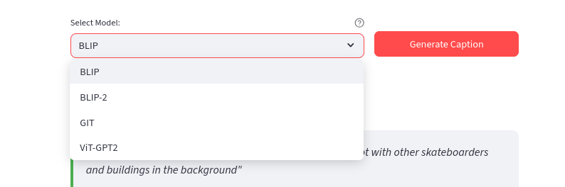

# Image Captioning 

## 🚀 Quick Start


### Installation
```bash
git clone https://github.com/aduy2408/Image-Captioning
cd Image-Captioning
pip install -r requirements.txt
```

### Launch Web Interface
```bash
streamlit run app.py
```

## Project Architecture

```
Case-Study3/
├── app.py                          # Main Streamlit web interface
├── model/
│   └── image_captioning_models.py     # Core model implementations & GPU optimization
├── notebooks_experiment/
│   ├── Image_captioning.ipynb         # Model experimentation & development
│   └── eval.ipynb                     # Comprehensive evaluation pipeline
├── test_images/
│   └── images/                        # COCO dataset sample images (10 images)
├── eval_result_json/               # Model evaluation results storage
│   ├── local_evaluation_blip.json
│   ├── local_evaluation_blip2.json
│   ├── local_evaluation_git.json
│   └── local_evaluation_vit_gpt2.json
├── captions_ground_truth.json      # COCO ground truth annotations
└── requirements.txt               
```

## Models

### 1. **BLIP-2** (Salesforce/blip2-opt-2.7b)

### 2. **BLIP** (Salesforce/blip-image-captioning-base)

### 3. **GIT** (microsoft/git-base-coco)

### 4. **ViT-GPT2** (nlpconnect/vit-gpt2-image-captioning)

## Core Components

### Model Engine (`model/image_captioning_models.py`)

**Core Functions:**
```python
def test_blip2(image)              # BLIP-2 inference
def test_blip(image)               # BLIP inference  
def test_git_model(image)          # GIT inference
def test_vit_gpt2(image)           # ViT-GPT2 inference
```

### Web Interface (`app.py`)


### Evaluation (`notebooks_experiment/`)

**Metrics:**
- **BLEU Scores**: BLEU-1, BLEU-2, BLEU-3, BLEU-4 (n-gram precision)
- **CIDEr Score**: Consensus-based Image Description Evaluation
- **Ground Truth Comparison**: Against COCO human annotations


## Performance Benchmarks

### Evaluation Results (COCO Test Set - 10 Images)


## Configuration

### Optimization Settings
```python
# In model/image_captioning_models.py
GENERATION_CONFIG = {
    "max_length": 200,        # Maximum caption length
    "min_length": 25,         # Minimum caption length  
    "num_beams": 8,           # Beam search width
    "length_penalty": 1.2,    # Length normalization
    "repetition_penalty": 1.3, # Repetition avoidance
    "temperature": 0.8,       # Sampling temperature
    "top_p": 0.9,            # Nucleus sampling
    "do_sample": True         # Enable sampling
}
```

